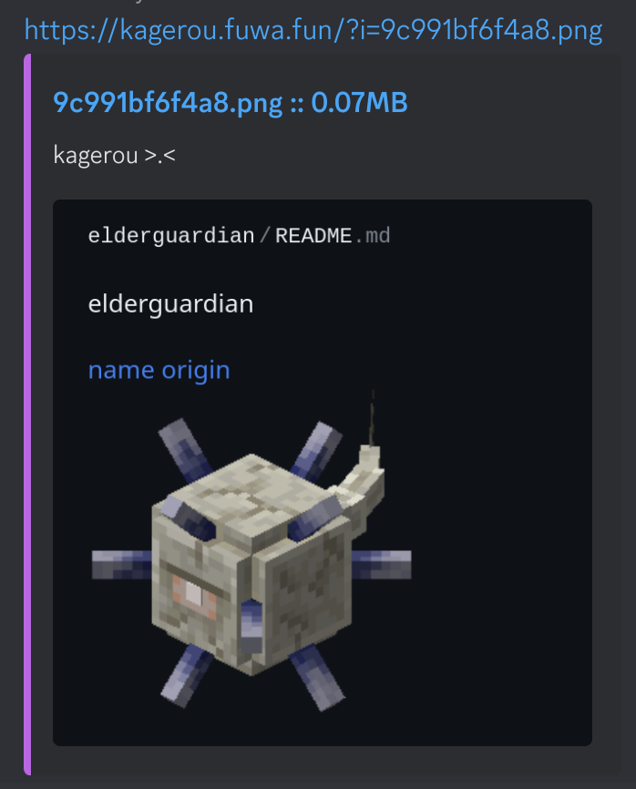

# kagerou
This is a screenshot upload server. There is a client available at [kagerou-client](https://github.com/elderguardian/kagerou-client).

## Preview


## Deployment
Clone the repository and move the files to your webservers folder.

### Apache
There is a .htaccess file in the repository. Make sure your apache configuration allows them and it should work.

### Nginx
This configuration should help you redirect everything to `index.php` except the `/static` folder.

```
server {
        server_name kagerou.example.com;
        root /path/to/kagerou ;
        index index.php;

        location /static/ {
                root /var/www/kagerou/ ;
                try_files $uri $uri/ index.html ;
        }

        location / {
                rewrite /?(.*)$ /index.php?path=$1 last;
        }

        location ~ \.php$ {
                include snippets/fastcgi-php.conf;
                fastcgi_pass unix:/run/php/php8.1-fpm.sock;
        }
```

## Configuration

Edit the `config.php` file. You can use `$fileName` and `$fileSizeMb` inside the embed title and description.
